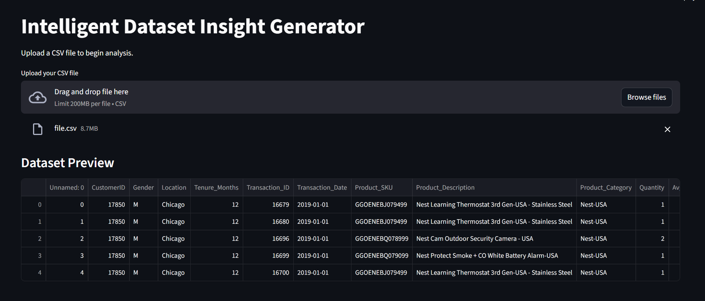
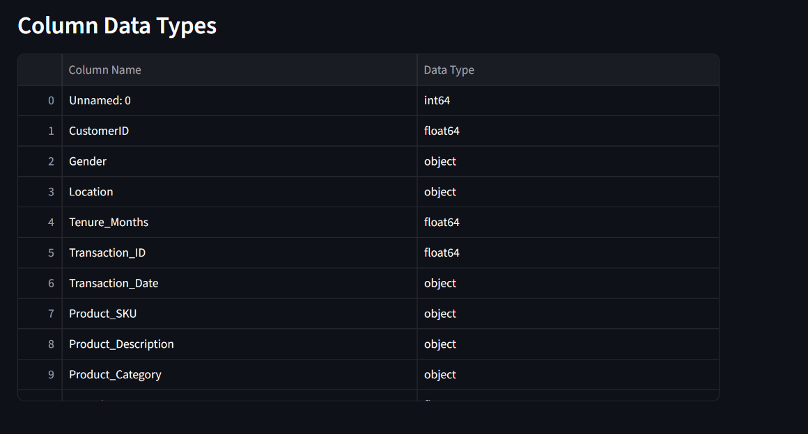
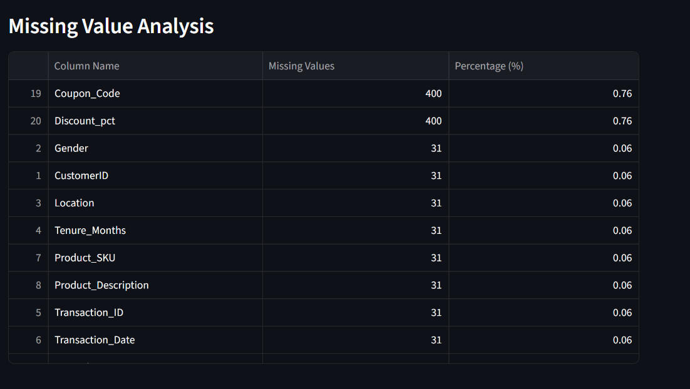
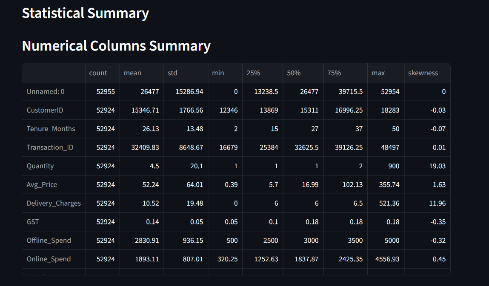
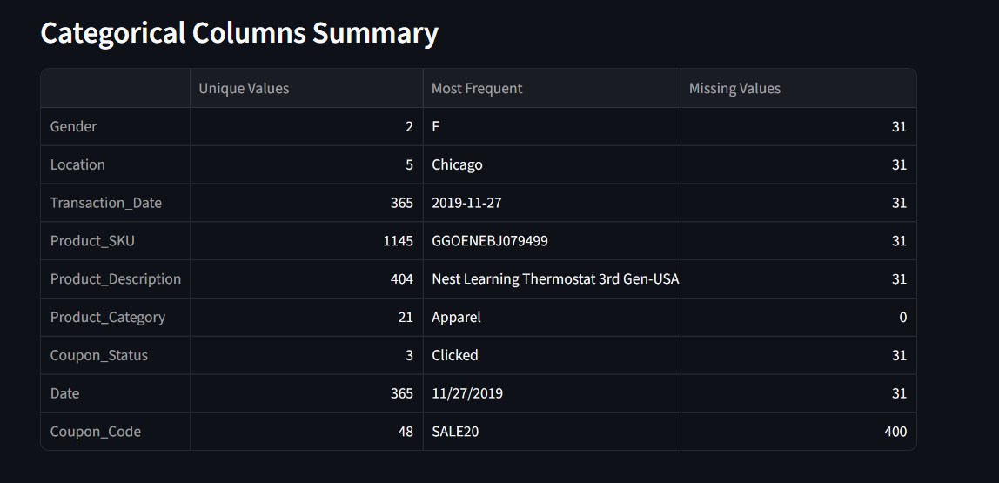
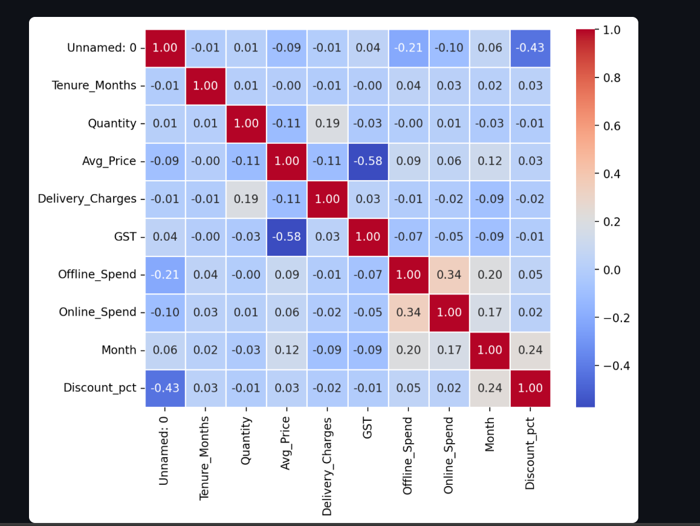
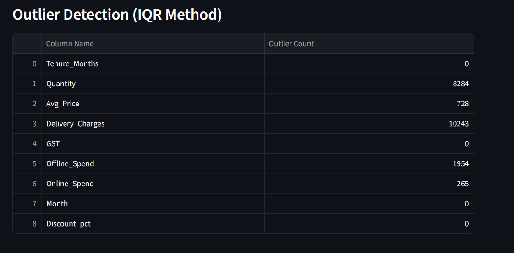
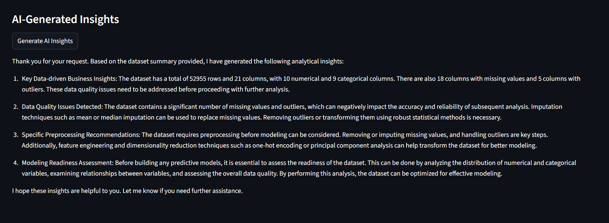

## Intelligent Dataset Insight Generator  

An AI-powered data analysis application built using **Streamlit** and **Pandas** that automates exploratory data analysis (EDA) and generates meaningful insights from structured datasets.

The application allows users to upload CSV datasets and instantly perform data profiling, detect data quality issues, visualize relationships, and generate **AI-driven insights using a local LLM**.

This project focuses on reducing manual effort in data exploration by transforming raw datasets into structured, interpretable insights for faster and more efficient decision-making.

---

## Demo  

### Dashboard Overview  


### Column Data Types  


### Missing Value Analysis  


### Numerical Columns Summary  


### Categorical Columns Summary  


### Correlation Heatmap  


### Outlier Detection (IQR Method)  


### AI-Generated Insights  


---

## Features  

- Upload any CSV dataset for automated analysis  
- Automatic dataset preview (top records)  
- Column data type detection 
- Missing value analysis with percentage insights 
- Numerical statistics (mean, median, skewness)
- Categorical summary (unique values,frequency distribution)  
- Correlation heatmap visualization 
- Outlier detection using the IQR method  
- AI-powered insights using a local LLM:
  - Business insights  
  - Data quality issues  
  - Preprocessing recommendations  
  - Modeling readiness assessment  

---

## Tech Stack  

- Python  
- Streamlit  
- Pandas  
- Matplotlib  
- Seaborn  
- Requests  
- Local LLM (Ollama - phi model)  

---

## How to Run Locally  

1. Clone the repository:
```bash
git clone https://github.com/RajaniMopidevi/Intelligent-Dataset-Insight-Generator.git
```
2. Navigate to the project folder:
```bash
cd Intelligent-Dataset-Insight-Generator
```
3. Install dependencies:
```bash
pip install -r requirements.txt
```
4. Ensure Ollama is running locally:
```bash
ollama run phi
```
5. Run the Streamlit app:
```bash
streamlit run app.py
```
or 
```bash
python -m streamlit run app.py
```

---

### Project Structure

app.py        → Main application (UI + EDA logic)
assets/       → Screenshots for README demo
requirements.txt → Project dependencies
README.md     → Project documentation  

---

### Future Improvements

- Export full EDA report as PDF
- Add automated preprocessing pipeline
- Enable cleaned dataset download
- Introduce feature importance suggestions
- Deploy using Streamlit Cloud or Docker
- Add authentication for multi-user access
